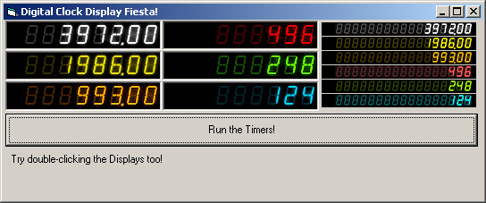



## Digital Clock Display ActiveX Control

### Description

Displays Numbers. Looks like a real LED display like the one used in Digital Clocks. (Except it offers more colors)
 
### More Info
 
Just the number you want to display. Accepts decimals.

Excessive good looks for your application :)

             |
---                |---
**Submitted On**   |2003-04-09 01:44:50
**By**             |[Rick Ilyasov](https://github.com/Planet-Source-Code/PSCIndex/blob/master/ByAuthor/rick-ilyasov.md)
**Level**          |Advanced
**User Rating**    |4.8 (43 globes from 9 users)
**Compatibility**  |VB 6\.0
**Category**       |[Custom Controls/ Forms/  Menus](https://github.com/Planet-Source-Code/PSCIndex/blob/master/ByCategory/custom-controls-forms-menus__1-4.md)
**World**          |[Visual Basic](https://github.com/Planet-Source-Code/PSCIndex/blob/master/ByWorld/visual-basic.md)
**Archive File**   |[Digital\_Cl157129492003\.zip](https://github.com/Planet-Source-Code/rick-ilyasov-digital-clock-display-activex-control__1-44620/archive/master.zip)

### API Declarations

BitBlt function

